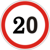
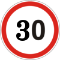
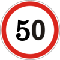
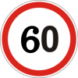
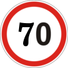
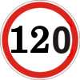
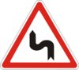
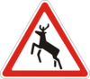

# Computer Vision GTSRB

This project detects and classifies German traffic signs using a YOLO model trained from the GTSRB dataset prepared in this workspace. The repository contains the raw GTSRB metadata, converted YOLO-format labels, class reference images from `Meta/`, a training configuration file, a trained model checkpoint, and a Flask web interface for testing predictions on uploaded images.

## What GTSRB Is

GTSRB stands for German Traffic Sign Recognition Benchmark. It is a widely used computer vision dataset for traffic sign recognition. The original benchmark focuses on recognizing cropped traffic sign images and assigning each image to one of 43 sign classes.

In this project, the GTSRB classification data is adapted into a YOLO-style object detection format. YOLO expects each image to have a label file describing object bounding boxes. The local `Train.csv` and `Test.csv` files already include region-of-interest coordinates for each sign, so they can be converted into YOLO labels.

The project uses 43 classes, covering common German road signs such as speed limits, priority signs, warning signs, mandatory direction signs, end-of-restriction signs, and prohibitory signs.

## Local Project Sources

The main local files and folders used by this project are:

| Path | Purpose |
| --- | --- |
| `Train.csv` | GTSRB training metadata, image paths, class IDs, image dimensions, and ROI boxes. |
| `Test.csv` | GTSRB test metadata with the same structure as the training CSV. |
| `Meta.csv` | Metadata for each class, including class ID and sign metadata. |
| `GTSRB/Meta/` | Reference sign image for each class ID, used in the class table below. |
| `Train/` | Original GTSRB training images grouped by class folder. |
| `Test/` | Original GTSRB test images. |
| `Meta/` | Class reference sign files. |
| `convert_gtsrb.py` | Converts GTSRB rows from `Train.csv` into YOLO image and label files. |
| `dataset_gtsrb/train/images/` | Converted training images saved as `.jpg`. |
| `dataset_gtsrb/train/labels/` | YOLO-format labels for the converted training images. |
| `dataset_augmented/val/images/` | Validation images used by the local YOLO configuration. |
| `traffic_signs_gtsrb.yaml` | YOLO dataset configuration with paths, class count, and class names. |
| `GTSRB/best.pt` | Trained YOLO model checkpoint used by the web app. |
| `GTSRB/WebPredict.py` | Flask application for uploading an image and running model inference. |

## Dataset Size In This Workspace

The local CSV and converted dataset contain:

| Source | Count |
| --- | ---: |
| Rows in `Train.csv` | 39,209 |
| Rows in `Test.csv` | 12,630 |
| Converted files in `dataset_gtsrb/train/images/` | 39,209 |
| Converted labels in `dataset_gtsrb/train/labels/` | 39,209 |
| Validation images referenced locally in `dataset_augmented/val/images/` | 102 |

Each training row corresponds to one traffic sign image and one label. After conversion, every training image has a matching `.txt` YOLO label file.

## GTSRB CSV Format

The local `Train.csv` and `Test.csv` files use this column structure:

```text
Width,Height,Roi.X1,Roi.Y1,Roi.X2,Roi.Y2,ClassId,Path
```

Each row describes one traffic sign sample:

| Column | Meaning |
| --- | --- |
| `Width` | Width of the source image in pixels. |
| `Height` | Height of the source image in pixels. |
| `Roi.X1` | Left coordinate of the sign region. |
| `Roi.Y1` | Top coordinate of the sign region. |
| `Roi.X2` | Right coordinate of the sign region. |
| `Roi.Y2` | Bottom coordinate of the sign region. |
| `ClassId` | Numeric class ID from 0 to 42. |
| `Path` | Relative path to the image file. |

For example, a row like this:

```text
27,26,5,5,22,20,20,Train/20/00020_00000_00000.png
```

means:

- The image is 27 pixels wide and 26 pixels high.
- The sign region begins at pixel `(5, 5)` and ends at pixel `(22, 20)`.
- The class ID is `20`.
- The source image path is `Train/20/00020_00000_00000.png`.

## Why Conversion Is Needed

GTSRB metadata stores bounding boxes as absolute pixel coordinates:

```text
x1, y1, x2, y2
```

YOLO labels use normalized center-based coordinates:

```text
class_id center_x center_y width height
```

The values after `class_id` must be between 0 and 1. They are normalized by dividing by the image width and height.

The conversion formulas used by `convert_gtsrb.py` are:

```text
center_x = (x1 + x2) / 2 / image_width
center_y = (y1 + y2) / 2 / image_height
box_w    = (x2 - x1) / image_width
box_h    = (y2 - y1) / image_height
```

So the CSV row becomes a YOLO label line such as:

```text
20 0.500000 0.480769 0.629630 0.576923
```

The exact values depend on the image dimensions and ROI coordinates.

## Conversion Script

The file `convert_gtsrb.py` performs the local GTSRB-to-YOLO conversion.

It does the following:

1. Reads `Train.csv`.
2. Builds the source image path from the `Path` column.
3. Reads image width, image height, ROI coordinates, and class ID.
4. Converts the ROI box to normalized YOLO format.
5. Clamps values into valid YOLO ranges.
6. Creates a unique output filename from the original path.
7. Converts the source image to RGB and saves it as `.jpg`.
8. Writes one `.txt` label file beside the converted image.
9. Reports how many images were converted or skipped.

The output directory is:

```text
dataset_gtsrb/train
```

Inside it, YOLO expects this structure:

```text
dataset_gtsrb/
  train/
    images/
    labels/
```

For each image in `images/`, there is a label file with the same base filename in `labels/`.

## YOLO Label Format

Each `.txt` file in `dataset_gtsrb/train/labels/` contains one line:

```text
class_id center_x center_y width height
```

Example:

```text
14 0.500000 0.500000 0.700000 0.700000
```

This means:

- `14` is the class ID.
- `0.500000` is the horizontal center of the bounding box.
- `0.500000` is the vertical center of the bounding box.
- `0.700000` is the normalized box width.
- `0.700000` is the normalized box height.

Because the original GTSRB images are already cropped around traffic signs, most boxes cover a large part of the image.

## YOLO Dataset Configuration

The local YOLO configuration is stored in `traffic_signs_gtsrb.yaml`.

Important values:

```yaml
path: /content/drive/MyDrive/traffic-signs
train: dataset_gtsrb/train/images
val: dataset_augmented/val/images
nc: 43
```

The config tells YOLO:

- The dataset root path.
- Where the training images are.
- Where the validation images are.
- That there are 43 classes.
- The name attached to each class ID.

Note: the `path` value currently points to a Google Drive style path. If training locally from this repository, that path may need to be changed to the local project path or to `.` depending on the training command.

## Class List With Meta Images

The project uses the following 43 GTSRB class IDs. The sign thumbnails are loaded from `GTSRB/Meta/`, using one reference image per class. These names are written to match the actual visual meaning of each `Meta/<class_id>.png` image.

| Sign | ID | Class name | Training rows |
| --- | ---: | --- | ---: |
|  | 0 | `speed_limit_20` | 210 |
|  | 1 | `speed_limit_30` | 2,220 |
|  | 2 | `speed_limit_50` | 2,250 |
|  | 3 | `speed_limit_60` | 1,410 |
|  | 4 | `speed_limit_70` | 1,980 |
|  | 5 | `speed_limit_80` | 1,860 |
|  | 6 | `speed_limit_80_end` | 420 |
|  | 7 | `speed_limit_100` | 1,440 |
|  | 8 | `speed_limit_120` | 1,410 |
|  | 9 | `no_passing` | 1,470 |
|  | 10 | `no_passing_trucks` | 2,010 |
|  | 11 | `right_of_way_next_intersection` | 1,320 |
|  | 12 | `priority_road` | 2,100 |
|  | 13 | `yield` | 2,160 |
|  | 14 | `stop` | 780 |
|  | 15 | `no_vehicles` | 630 |
|  | 16 | `no_trucks` | 420 |
|  | 17 | `no_entry` | 1,110 |
|  | 18 | `general_caution` | 1,200 |
|  | 19 | `dangerous_curve_left` | 210 |
|  | 20 | `dangerous_curve_right` | 360 |
|  | 21 | `double_curve` | 330 |
|  | 22 | `bumpy_road` | 390 |
|  | 23 | `slippery_road` | 510 |
|  | 24 | `road_narrows_right` | 270 |
|  | 25 | `road_work` | 1,500 |
|  | 26 | `traffic_signals` | 600 |
|  | 27 | `pedestrians` | 240 |
|  | 28 | `children_crossing` | 540 |
|  | 29 | `bicycles_crossing` | 270 |
|  | 30 | `beware_ice_snow` | 450 |
|  | 31 | `wild_animals_crossing` | 780 |
|  | 32 | `end_speed_and_passing_limits` | 240 |
|  | 33 | `turn_right_ahead` | 689 |
|  | 34 | `turn_left_ahead` | 420 |
|  | 35 | `ahead_only` | 1,200 |
|  | 36 | `go_straight_or_right` | 390 |
|  | 37 | `go_straight_or_left` | 210 |
|  | 38 | `keep_right` | 2,070 |
|  | 39 | `keep_left` | 300 |
|  | 40 | `roundabout_mandatory` | 360 |
|  | 41 | `end_no_overtaking` | 240 |
|  | 42 | `end_no_overtaking_trucks` | 240 |

The class distribution is imbalanced. Some classes have more than 2,000 training samples, while others have only around 210 to 300. This matters during training because the model can learn frequent classes more easily than rare ones.

## Training Meaning

The trained model is stored as:

```text
GTSRB/best.pt
```

This is a YOLO checkpoint file. In YOLO workflows, `best.pt` usually represents the best-performing model saved during training, based on validation metrics.

The model learns two tasks at the same time:

1. Localization: predicting where a traffic sign appears in the image.
2. Classification: predicting which of the 43 classes the sign belongs to.

Because GTSRB images are mostly cropped around a single sign, the detection problem is simpler than full-road-scene detection. The model still outputs a bounding box, class label, and confidence score.

## Inference Web App

The file `GTSRB/WebPredict.py` provides a Flask web interface.

It loads the trained checkpoint with:

```python
model = YOLO('best.pt')
```

The app has two routes:

| Route | Purpose |
| --- | --- |
| `/` | Serves the upload interface. |
| `/predict` | Accepts an uploaded image, runs YOLO inference, and returns JSON. |

The prediction flow is:

1. User uploads an image.
2. Browser sends the image to `/predict`.
3. Flask reads the image with Pillow.
4. YOLO runs prediction using the selected confidence threshold.
5. The app draws detections on the image.
6. The annotated image is returned as base64.
7. Detected labels and confidence scores are returned as JSON.

The JSON response contains:

```json
{
  "image": "base64_encoded_result_image",
  "detections": [
    {
      "label": "stop",
      "conf": 0.94
    }
  ]
}
```

The interface also shows:

- Number of detections.
- Average confidence.
- Approximate inference time from the browser request.
- A tag for each detected class.

## Running The Web App

From inside the `GTSRB` folder, the app can be run with:

```bash
python WebPredict.py
```

The Flask server starts on:

```text
http://127.0.0.1:5000
```

The file `best.pt` must stay in the same folder as `WebPredict.py`, because the app loads it using the relative path `best.pt`.

Required Python packages include:

```text
flask
ultralytics
pillow
```

## Practical Notes

The project has two related traffic sign dataset preparations in the root:

- `structure.txt` and `convert_gtsdb.py` describe GTSDB, the German Traffic Sign Detection Benchmark.
- `convert_gtsrb.py`, `Train.csv`, `Test.csv`, and `traffic_signs_gtsrb.yaml` describe the GTSRB workflow used by this README.

GTSDB and GTSRB are related but not identical:

| Dataset | Main task | Local evidence |
| --- | --- | --- |
| GTSDB | Detect signs in larger road-scene images. | `gt.txt`, `convert_gtsdb.py`, `dataset/` |
| GTSRB | Recognize sign classes from cropped sign images. | `Train.csv`, `Test.csv`, `convert_gtsrb.py`, `dataset_gtsrb/` |

This README focuses on GTSRB because it is located inside the `GTSRB/` folder and matches the local trained model and web app.

## Common Issues

If the web app cannot find the model, make sure the command is run from the `GTSRB` folder or update the model path in `WebPredict.py`.

If YOLO training cannot find the dataset, check `traffic_signs_gtsrb.yaml`. The `path` value may need to match the local environment instead of the current Google Drive path.

If a class seems to perform poorly, check the class distribution. Classes with fewer samples, such as `speed_limit_20`, `dangerous_curve_left`, and `go_straight_or_left`, may need augmentation or additional data.

If predictions work on cropped signs but not on full road images, that is expected. GTSRB is mainly composed of cropped sign images, so a model trained only on this data may not generalize perfectly to distant signs in full driving scenes.

## Summary

This project turns GTSRB traffic sign data into a YOLO-compatible detection dataset, trains or uses a YOLO checkpoint with 43 traffic sign classes, and provides a Flask interface for testing predictions. The key workflow is:

```text
Train.csv -> convert_gtsrb.py -> dataset_gtsrb/train -> traffic_signs_gtsrb.yaml -> YOLO training -> best.pt -> WebPredict.py
```

The result is a working traffic sign detector/classifier that can receive an uploaded image, locate the sign, assign one of 43 GTSRB classes, and return confidence scores through a simple web app.
